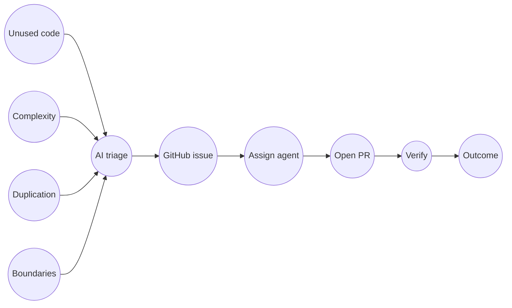

# wall-e

AI-powered semantic tech debt scanning for Ruby on Rails applications.

`wall-e` helps teams detect and track architectural debt that linters usually miss: structurally duplicated code blocks, duplicated business logic, leaked domain rules, dead code, and complexity hotspots. It runs in GitHub Actions, triages findings with an LLM, enriches issue text for verification, and creates deduplicated GitHub Issues using deterministic fingerprints. Optional **PR verification** (`--verify-pr` or a dedicated workflow) checks linked issues against the PR diff using static tools first and a focused LLM only when needed.

**Semantic triage (default scan path) uses the OpenAI Chat Completions API** via the `ruby-openai` gem. Settings such as `llm.provider` in `config/wall_e_settings.yml` are reserved for future multi-provider support and are not honored today. To run without any LLM calls, use `--skip-llm` (static collectors only).

## Why this gem exists

Traditional static analysis catches syntax and style problems. It usually does not catch semantic debt such as:

- Controller actions with embedded business workflows
- Structurally identical or near-identical code blocks copy-pasted across files
- Similar business rules duplicated across different domains
- Logic that should be extracted into concerns/services/query objects
- Uncalled methods and high-complexity methods that increase maintenance cost

This gem combines static signals (`debride`, `flog`, `flay`) plus LLM triage so you get fewer noisy alerts and more actionable refactor tasks.

## What gets installed

Running the install generator adds these project files:

| File                                   | Purpose                                      |
| -------------------------------------- | -------------------------------------------- |
| `.github/workflows/wall_e_scan.yml`    | Scheduled/manual scan                        |
| `.github/workflows/wall_e_verify.yml`    | Optional PR verification on `pull_request`   |
| `config/wall_e_settings.yml`           | Scanner, LLM, GitHub, auto-assign, verification |
| `.github/prompts/wall_e_analysis.md`   | System prompt for semantic triage            |
| `.github/prompts/wall_e_issue_writer.md` | Second-pass prompt: criteria + baselines   |
| `.github/prompts/wall_e_verification.md` | PR verification prompt (LLM fallback)      |

## Requirements

- Ruby >= 3.1
- Rails >= 7.0 (for the install generator)
- GitHub repository with Actions enabled
- **OpenAI API key** (required for semantic triage; not required when using `--skip-llm`)

### Provider setup for issue auto-assignment

If you enable **`auto_assign`** in `config/wall_e_settings.yml`, wall-e will assign Copilot to the issue or post a trigger comment (`@cursor`, `/opencode`, `@claude`). **That alone does not run the agent** — you still need the provider’s GitHub app, permissions, workflows, and API keys configured per their documentation.

| `auto_assign.agent` | Where to set up the integration |
| ------------------- | ------------------------------- |
| `copilot` | [GitHub Copilot documentation](https://docs.github.com/en/copilot) — enable **Copilot coding agent** for the org/repo and meet licensing; [quickstart](https://docs.github.com/en/copilot/get-started/quickstart) |
| `cursor` | [GitHub integration](https://cursor.com/docs/integrations/github) (Cursor Docs) — install the app, connect the repo, and ensure `@cursor` on issues is supported for your plan |
| `opencode` | [OpenCode on GitHub](https://opencode.ai/docs/github/) — separate workflow that reacts to `/opencode` (or similar) on issues |
| `claude` | [Claude Code GitHub Actions](https://code.claude.com/docs/en/github-actions) — install the [Claude GitHub app](https://github.com/apps/claude), add `ANTHROPIC_API_KEY`, and add a workflow so `@claude` on issues actually runs Claude Code |

Use the sections below for wall-e-specific token and behavior notes after the provider is working.

## Installation

### 1) Add the gem

```ruby
# Gemfile
group :development do
  gem "wall-e", github: "TelosLabs/wall-e"
end
```

```sh
bundle install
```

### 2) Install project files

```sh
bin/rails generate wall_e:install
```

### 3) Configure GitHub secrets

Add this repository secret when jobs call OpenAI:

- `OPENAI_API_KEY` — required for semantic **triage** and the **issue writer** (skip both with `--skip-llm` on the scan). For **PR verification**, OpenAI is used only when static verification is inconclusive; keep the secret available in workflows that may hit the LLM verifier.

`GITHUB_TOKEN` is provided automatically by GitHub Actions and is used for issue queries/creation and, by default, for assignment/comment operations when no explicit assignment token is configured.

Optional (recommended if you enable auto-assignment or agent-style issue comments):

- `AGENT_ASSIGN_TOKEN` — Personal Access Token for assignment/comment operations (Copilot assignee, or issue comments for Cursor `@cursor`, OpenCode `/opencode`, or Claude `@claude`). If this is not set, the process falls back to `GITHUB_TOKEN`, which may not be sufficient for some providers (for example, Copilot assignment may require a user PAT).

## How it works

1. Collect static candidates from dead-code, complexity, structural duplication, and layer-violation signals.
2. Read code snippets for candidate files.
3. Send candidates + snippets to **OpenAI** for semantic triage with Rails-focused risk checks.
4. Run a second batched **issue writer** call (unless `--skip-llm`) to add `acceptance_criteria`, `baseline_metrics`, and tightened wording.
5. Normalize verification fields on each finding and compute fingerprints.
6. Search GitHub Issues for existing fingerprints.
7. Create only new issues (idempotent behavior). Each body includes a **Verification Criteria** section and a hidden `wall_e_verification` JSON blob for PR checks.
8. Optionally auto-assign or post an agent trigger comment that includes **`Fixes #N`** so the fixing PR links to the issue.

### Closed-loop flow

Three static passes feed **AI triage**; each finding becomes a **GitHub issue** ready to verify. After **assign agent** and **open PR**, **verify** runs quick checks first and only then a narrow AI review when the answer is still unclear. **Outcome** is posted on the PR (pass, partial, or fail).



| Step | Meaning |
| ---- | ------- |
| **Unused code** | Signals that look like dead or unreachable paths. |
| **Complexity** | Hot spots where methods are doing too much work. |
| **Duplication** | Structurally identical or near-identical code blocks across files (AST-level, via flay). |
| **Boundaries** | Hints that logic may sit in the wrong layer of the app. |
| **AI triage** | The model confirms, merges, or rejects signals and turns them into findings. |
| **GitHub issue** | Each finding becomes a tracked issue—with clear “how we’ll know it’s fixed.” |
| **Assign agent** | Copilot, Cursor, OpenCode, Claude, or your process picks up the thread (the PR links back via the issue). |
| **Open PR** | The fix ships as a pull request tied to that issue. |
| **Verify** | The pipeline re-checks the changed code; cheap tools first, focused AI only if still unclear. |
| **Outcome** | Pass, partial, or fail is posted on the PR—the loop closes visibly for the team. |

### Triage priorities

The default prompt prioritizes high-impact Rails risks when they appear in scanned snippets:

- SQL/data safety issues and fragile query construction
- Race/concurrency risks in read-check-write flows
- Unvalidated LLM output crossing trust boundaries
- Enum/status completeness gaps across branches/allowlists

These are still emitted using the existing debt taxonomy (`fat_controller`, `leaked_business_logic`, `semantic_duplication`, `structural_duplication`, `missing_concern`, `dead_code`, `high_complexity`) to keep output stable.

## Fingerprinting and deduplication

Each issue includes hidden HTML comments in the body:

```html
<!-- tech_debt_fingerprint:<sha1> -->
<!-- wall_e_verification:{...json...} -->
```

The scanner checks open and closed issues for the **fingerprint** before creating a new issue. The **`wall_e_verification`** block stores `debt_type`, paths, baselines, and acceptance criteria for `--verify-pr`.

- Default fingerprint input: `file_path + identifier + debt_type`
- `semantic_duplication` uses `canonical_pattern` when present

This prevents duplicate issues across repeated runs.

## Running locally

### Dry run (recommended first)

```sh
bundle exec wall-e --dry-run
```

Runs analysis and prints what would be created without calling the GitHub Issues API.

### Dry run without LLM

```sh
bundle exec wall-e --dry-run --skip-llm
```

Uses only static collectors (`debride`, `flog`, `flay`, layer checks) and skips semantic triage and the issue writer. Findings still carry default `baseline_metrics` for verification metadata.

### PR verification (`--verify-pr`)

Verify an open pull request against **linked** wall-e issues whose bodies contain `wall_e_verification` JSON (created by current scan output). The command parses `fixes` / `closes` / `resolves` references to issue numbers from the PR body and commits, loads each issue, and runs static checks (flog, debride, or a `Current.*` model check when applicable) on Ruby files touched by the PR. If static checks cannot decide, a small **LLM** call uses `.github/prompts/wall_e_verification.md`.

```sh
bundle exec wall-e --verify-pr 42
bundle exec wall-e --verify-pr 42 --dry-run
bundle exec wall-e --verify-pr 42 --verification-prompt .github/prompts/wall_e_verification.md
```

With `--dry-run`, no PR comment is posted and issues are not closed.

Optional `config/wall_e_settings.yml`:

```yaml
verification:
  close_on_pass: false # if true, API-closes linked issues when every check verdict is pass
```

Install the **`wall_e_verify`** workflow (via `rails g wall_e:install`) to run verification on `pull_request` events. If no linked issues contain wall-e verification metadata, the run exits early with minimal work.

## GitHub Actions usage

The **scan** workflow supports:

- `schedule` (weekly by default)
- `workflow_dispatch` with optional `dry_run` input

The **verify** workflow (`wall_e_verify.yml`) runs on `pull_request` (`opened`, `synchronize`) and executes `bundle exec wall-e --verify-pr <number>`.

Manual scan example:

1. Open **Actions** in your repo
2. Select **wall-e Scan**
3. Click **Run workflow**
4. Set `dry_run=true` for safe validation

## Auto-assign AI agents

You can optionally auto-dispatch newly created issues to an AI coding agent right after issue creation.

Add this to `config/wall_e_settings.yml`:

```yaml
auto_assign:
  enabled: true
  agent: "claude" # "copilot" | "cursor" | "opencode" | "claude"
  token_env: "AGENT_ASSIGN_TOKEN"
  filters:
    min_severity: "medium" # low, medium, high
    debt_types: [] # empty means all debt types
```

How each mode works:

- `agent: "copilot"`: assigns the issue to GitHub Copilot coding agent (`copilot-swe-agent[bot]`). Uses a short built-in delay before assigning to reduce race issues.
- `agent: "cursor"`: posts an issue comment starting with `@cursor`, a fixed instruction to analyze and open a PR, **`Fixes #N`**, and structured context (`debt_type`, `severity`, `file_path`).
- `agent: "opencode"`: same pattern with a `/opencode` prefix so a separate [OpenCode GitHub workflow](https://opencode.ai/docs/github/) can pick it up.
- `agent: "claude"`: same pattern with an `@claude` prefix for tools that react to Claude on GitHub.

Recommended setup:

1. Keep `enabled: false` first and run one scan to validate issue quality.
2. Add `AGENT_ASSIGN_TOKEN` as a repo/org secret.
3. Enable with a conservative filter (`min_severity: "high"`), then relax later.

### Copilot setup

1. Enable and use **Copilot coding agent** per [GitHub Copilot documentation](https://docs.github.com/en/copilot) and the [quickstart](https://docs.github.com/en/copilot/get-started/quickstart) (org/repo settings, licensing, and agent availability).
2. wall-e–specific: use a PAT from a Copilot-licensed user with minimal permissions (Issues write + Metadata read) in `AGENT_ASSIGN_TOKEN` if `GITHUB_TOKEN` is not enough for assignment.

### Cursor setup

1. Complete Cursor’s GitHub integration: [GitHub integration](https://cursor.com/docs/integrations/github) (install the app, connect repos, confirm `@cursor` on issues/PRs works for your org).
2. wall-e–specific: use a PAT from a Cursor team user in `AGENT_ASSIGN_TOKEN` if needed. The instruction text in the issue comment is built into the gem; extend behavior via your Cursor automation if you need custom wording.

### Claude setup

1. Complete Anthropic’s setup so `@claude` on issues runs Claude Code — not just a bare comment: [Claude Code GitHub Actions](https://code.claude.com/docs/en/github-actions) (GitHub app, `ANTHROPIC_API_KEY`, workflow from [claude-code-action](https://github.com/anthropics/claude-code-action), etc.).
2. wall-e–specific: ensure `AGENT_ASSIGN_TOKEN` or `GITHUB_TOKEN` can create issue comments so the scan job can post `@claude` with **`Fixes #N`** and context.

### OpenCode setup

OpenCode runs in **its own** GitHub Actions workflow when a matching comment appears. wall-e only **creates that comment** on new issues; it does not install OpenCode for you.

1. Follow [OpenCode on GitHub](https://opencode.ai/docs/github/) to install the app, add the OpenCode workflow (for example `issue_comment` triggers), and configure model/API keys on **that** workflow.
2. wall-e–specific: set `auto_assign.agent` to `opencode`. wall-e prefixes the comment with `/opencode` plus the built-in instruction block. Use `AGENT_ASSIGN_TOKEN` (or a token with permission to create issue comments) so the scan job can post the trigger comment.

Assignment is best-effort: if assignment fails, issue creation still succeeds.

## Configuration reference

Main settings are in `config/wall_e_settings.yml`.

Key sections:

- `llm`: model, API key env name, temperature, token budget (semantic triage is **OpenAI-only** today; `provider` is not yet used). Use a **real** Chat Completions model id; invalid ids return HTTP 400.
- `llm.max_completion_tokens`: optional; when set, sent instead of `max_tokens`. For models whose id starts with **`gpt-5`**, wall-e sends **`max_completion_tokens`** automatically (value taken from **`max_tokens`** unless you set **`max_completion_tokens`** explicitly).
- `llm.omit_temperature`: when `true`, temperature is not sent. For **`gpt-5`*** models, temperature is omitted by default; set **`omit_temperature: false`** if you need to send **`temperature`** and your model allows it.
- `llm.retry_attempts` and `llm.retry_base_delay_seconds`: exponential backoff for OpenAI 429s
- `llm.batch_size` and `llm.inter_batch_delay_seconds`: split semantic triage into smaller LLM calls
- `analysis.paths` and `analysis.exclude_paths`: scan scope
- `analysis.flog_threshold` and `analysis.flay_threshold`: complexity and structural duplication thresholds
- `analysis.debt_types`: per-debt toggles and thresholds
- `github.labels`, `github.issue_prefix`, `github.max_issues_per_run`
- Scan summary JSON is written to **`tmp/wall_e_report.json`** (path is fixed in the gem today)
- `auto_assign`: optional post-creation dispatch to Copilot, Cursor, OpenCode, or Claude (issue comments include **`Fixes #N`** for Cursor/OpenCode/Claude)
- `verification.close_on_pass`: when `true`, successful PR verification closes linked issues via the API (default `false`)

`ai-detected` and `severity:*` labels are managed automatically by the gem. Keep `github.labels` for shared/static labels (for example `tech-debt`).

Prompts you can edit after install:

- `.github/prompts/wall_e_analysis.md` — semantic triage
- `.github/prompts/wall_e_issue_writer.md` — criteria and baselines for issues
- `.github/prompts/wall_e_verification.md` — LLM fallback during `--verify-pr`

## Interpreting scores

`score` is numeric for sorting/prioritization, but not all debt types use the same scale:

- `high_complexity`: complexity metric (for example flog score) relative to configured threshold
- `semantic_duplication`: estimated duplicated impact/lines
- `structural_duplication`: flay base mass score (AST structural weight of the duplicated block)
- `dead_code`: count-based dead-code signal
- Other types: heuristic impact estimate (0-100)

## CLI options

```sh
bundle exec wall-e [options]
```

| Option                      | Description |
| --------------------------- | ----------- |
| `--config PATH`             | Path to settings YAML |
| `--prompt PATH`             | Path to semantic triage prompt (default `.github/prompts/wall_e_analysis.md`) |
| `--issue-writer-prompt PATH` | Path to issue writer prompt (default `.github/prompts/wall_e_issue_writer.md`) |
| `--verification-prompt PATH` | Path to PR verification LLM prompt (default `.github/prompts/wall_e_verification.md`) |
| `--dry-run`                 | Scan: do not create issues. Verify: do not comment or close issues. |
| `--skip-llm`                | Skip triage and issue writer; static collectors only |
| `--max-issues N`            | Override max issues to create (for testing) |
| `--verify-pr NUMBER`        | Run PR verification instead of a repo scan |

## Troubleshooting

**`cannot load such file -- octokit`**

- Run with bundler: `bundle exec wall-e`

**LLM JSON parse errors (`unexpected end of input`)**

- Increase `llm.max_tokens`
- Reduce scanned scope in `analysis.paths`
- Keep `--dry-run` while tuning

**No issues created**

- Check `github.max_issues_per_run`
- Confirm findings are not duplicates by fingerprint
- Verify `GITHUB_TOKEN` has `issues: write` permission in workflow

**LLM / OpenAI errors**

- Semantic triage calls **OpenAI only**; verify `OPENAI_API_KEY` is present in repository secrets
- Confirm `llm.model` is a valid **Chat Completions** model for your account (for example `gpt-4o`, `gpt-4o-mini`). A placeholder or unreleased name causes **HTTP 400**; wall-e logs the API error message when that happens.

**OpenAI `400 Bad Request` on chat/completions**

- Set `llm.model` to a model your key supports on `/v1/chat/completions`.
- For **`gpt-5.4-mini`** and other ids starting with **`gpt-5`**, wall-e already maps **`max_tokens`** → **`max_completion_tokens`** and skips **`temperature`** unless you set **`omit_temperature: false`**. If you still see 400, set an explicit **`max_completion_tokens`** cap or check the logged API **`error.message`**.
- For other models, if the error mentions **temperature**, set `llm.omit_temperature: true`.
- If the error mentions **max_tokens** / **max_completion_tokens**, set `llm.max_completion_tokens` (wall-e sends only that key when it is set).

**OpenAI 429 rate limits**

- Increase `llm.retry_attempts` and/or `llm.retry_base_delay_seconds`
- Decrease `llm.batch_size` (for example `10` or `8`) to lower per-request token load
- Increase `llm.inter_batch_delay_seconds` (for example `3.0` or `5.0`) to reduce request burstiness
- Reduce scanned scope in `analysis.paths` or run in dry mode while tuning

**Auto-assignment 404 for Copilot**

- Ensure Copilot coding agent is enabled for the repository/organization
- Create a fine-grained PAT from a Copilot-licensed user with Issues write + Metadata read permissions
- Store the PAT in `AGENT_ASSIGN_TOKEN` as a repository or organization secret
- The default `GITHUB_TOKEN` does not have sufficient scope for Copilot assignment
- If you do not want auto-assignment, set `auto_assign.enabled: false` in your config

**Copilot "agent encountered an error" / "repository ruleset violation"**

- This usually happens when assigning Copilot to multiple issues in quick succession
- The gem waits a few seconds before each Copilot assignment; space out bulk runs or lower `github.max_issues_per_run` if Copilot still races rulesets
- If the repo has rulesets or branch protection, add Copilot coding agent as a bypass actor
- Manual re-assignment via the GitHub UI is a workaround if the agent still fails to start

**PR verification skipped or no results**

- Ensure the PR body or commit messages reference linked issues with `Fixes #123`-style keywords
- Linked issues must contain the `wall_e_verification` HTML comment (create issues with a current wall-e scan, not hand-written bodies unless you copy the format)
- Use `--dry-run` to inspect JSON output without posting a PR comment

## TODO

- [ ] Enhance fingerprint generation to avoid creating duplicate issues for the same code, given AI-generated titles.
- [ ] Define a strategy to handle existing issues that are closed (the issue appeared again or it was originally ignored)
- [ ] Add support for other providers for LLM triage with adapter pattern (Anthropic, Gemini, etc.)
- [ ] Optional: configurable instruction text for Cursor/OpenCode/Claude comments (today a built-in default is used)

## License

MIT
